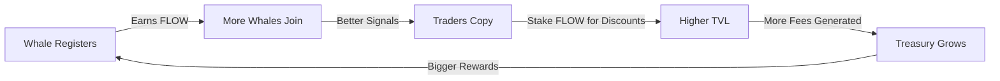

# FLOW Token: Riding the Currents of Bitcoin DeFi

## The Origin Story

In the vast ocean of Bitcoin DeFi, capital doesn't stand still—it **flows**. Like ocean currents that carry nutrients, opportunities, and energy across the depths, capital on Stacks moves in patterns. Some currents are visible, marked by the wake of whales. Others are subtle, detectable only through sentiment and social signals.

**StackFlow** emerged to help traders navigate these currents. But navigation alone isn't enough. To truly harness the power of these flows, the community needs a token that represents **participation in the flow itself**.

Enter **FLOW** — the native token of the StackFlow ecosystem.

---

## The Metaphor: Ocean Currents & Capital Flows

### 🌊 The Anatomy of Flow

In nature, ocean currents create ecosystems:
- **Gulf Stream**: Warm currents that bring prosperity
- **Cold Deep Currents**: Slow, powerful, predictable
- **Rip Currents**: Dangerous, volatile movements
- **Tidal Flows**: Cyclical, moon-driven patterns

In Bitcoin DeFi, capital creates similar patterns:
- **Whale Movements**: Large flows that shift market sentiment
- **Sentiment Waves**: Social signals that precede price action
- **Volatility Surges**: Rapid directional movements
- **Accumulation Cycles**: Slow, steady buildup phases

FLOW token holders aren't just observers—they're **current riders**. They stake their position, contribute to the ecosystem, and get rewarded as capital flows through the platform.

---

## The Five Pillars of FLOW Utility

### 1. 🎯 **Fee Discounts Through Staking**

**The Mechanism:**
- Stake FLOW tokens → Earn tier-based fee discounts on StackFlow options trading
- Discount tiers:
  - **Ripple Tier** (1,000+ FLOW staked): 10% fee discount
  - **Wave Tier** (5,000+ FLOW staked): 25% fee discount  
  - **Current Tier** (20,000+ FLOW staked): 50% fee discount
  - **Ocean Tier** (100,000+ FLOW staked): 75% fee discount

**Why it matters:**
Active traders save significantly on protocol fees. The more you trade, the more you save. This creates a natural incentive to acquire and stake FLOW.

### 2. 🗳️ **Governance Over Strategy Parameters**

**The Mechanism:**
- FLOW holders vote on:
  - New options strategies to add
  - Protocol fee adjustments
  - Minimum/maximum option periods
  - Treasury allocation for whale signal rewards
  - Integration of new sentiment sources

**Why it matters:**
The community, not a centralized team, shapes how StackFlow evolves. This aligns incentives between users, traders, and the protocol itself.

### 3. 💰 **Whale Signal Provider Rewards**

**The Mechanism:**
- "Verified Whales" who register their wallet for copy trading earn FLOW rewards
- Reward formula: `(Number of Copiers × Average Trade Size × Performance Score) = Monthly FLOW Allocation`
- Top-performing whales are leaderboarded and promoted

**Why it matters:**
Transparency is incentivized. Successful traders are rewarded for sharing their strategies, creating a meritocratic ecosystem rather than hiding alpha.

### 4. 🌊 **Liquidity Mining for Copy Trading Pools**

**The Mechanism:**
- Users who deposit capital into copy trading pools earn FLOW
- Rewards distributed proportional to:
  - Amount staked
  - Duration of stake
  - Performance of the pool

**Why it matters:**
This bootstraps liquidity for copy trading strategies, allowing smaller traders to participate in whale-level strategies.

### 5. 🔓 **Premium Features Access**

**The Mechanism:**
- Hold 500+ FLOW → Unlock premium analytics dashboard
- Hold 2,000+ FLOW → Access AI-powered sentiment reports
- Hold 10,000+ FLOW → Early access to new strategies
- Hold 50,000+ FLOW → Private whale signals (DMs)

**Why it matters:**
Information asymmetry is the edge in trading. FLOW holders get better data, faster.

---

## Tokenomics: The Flow Distribution

### Total Supply: **100,000,000 FLOW** (Fixed)

### Allocation Breakdown:

| Allocation | Percentage | Amount | Vesting | Purpose |
|------------|-----------|---------|---------|---------|
| **Community Rewards** | 40% | 40M FLOW | 4 years linear | Whale rewards, liquidity mining, copy trading incentives |
| **Ecosystem Development** | 25% | 25M FLOW | 5 years linear | Partnerships, integrations, marketing, grants |
| **Team & Contributors** | 20% | 20M FLOW | 4 years (1yr cliff) | Core team, advisors, early contributors |
| **Liquidity Provision** | 10% | 10M FLOW | Immediate | DEX liquidity on Stacks (ALEX, Velar) |
| **Public Distribution** | 5% | 5M FLOW | Immediate | Fair launch event, community airdrop |

### Emission Schedule:

**Years 1-2**: High emission (60% of rewards pool)
- Bootstrap liquidity
- Incentivize early whales to register
- Grow copy trading pools

**Years 3-4**: Moderate emission (30% of rewards pool)
- Sustainable growth
- Focus on retention over acquisition

**Years 5+**: Low emission (10% of rewards pool)
- Mature ecosystem
- Fee revenue > token incentives

---

## The Flywheel Effect



1. **Whales register** to earn FLOW rewards
2. **More whales = better signals** for copy traders
3. **Traders stake FLOW** to reduce fees
4. **Higher trading volume = more fees**
5. **Treasury uses fees to buy back FLOW** and reward whales
6. **Cycle repeats**, creating a self-reinforcing ecosystem

---

## The Narrative in Action: User Journeys

### 🐋 **Journey 1: The Whale (Verified Trader)**

**Profile:** Sarah has a $500K STX portfolio and consistently generates 30% APY.

**Flow Journey:**
1. Registers wallet as "Verified Whale" on StackFlow
2. 50 traders copy her moves, generating $100K in protocol fees/month
3. Earns 5,000 FLOW/month in rewards (~$500 if FLOW = $0.10)
4. Stakes FLOW for governance voting power
5. Proposes new "Diagonal Spread" strategy via governance
6. Community votes Yes → Sarah's strategy goes live
7. More copiers join → Sarah earns more FLOW

**Result:** Transparency is profitable. Skill is rewarded.

---

### 📊 **Journey 2: The Copy Trader (Retail User)**

**Profile:** Mike has $5K STX and wants to copy successful traders.

**Flow Journey:**
1. Browses top whales on StackFlow leaderboard
2. Deposits $5K into Sarah's copy trading pool
3. Earns FLOW rewards for providing liquidity (100 FLOW/month)
4. Stakes 1,200 FLOW to unlock "Ripple Tier" (10% fee discount)
5. Saves $50/month on trading fees
6. Uses premium analytics to discover new whales
7. Portfolio grows 25% in 6 months while earning passive FLOW

**Result:** Small traders get whale-level alpha + passive income.

---

### 🎨 **Journey 3: The Meme Investor (Community Member)**

**Profile:** Alex loves meme culture and viral trading.

**Flow Journey:**
1. Creates viral meme on Twitter about "$FLOW to the moon"
2. StackFlow's sentiment engine detects the meme
3. Community votes to create a meme-driven investment pool
4. Alex stakes 500 FLOW to join the pool
5. Pool generates 40% returns during a viral cycle
6. Earns 300 FLOW in rewards + 40% ROI
7. Uses FLOW to unlock premium features (AI sentiment reports)

**Result:** Community creativity is incentivized and rewarded.

---

## Why FLOW Has Real Value

### ❌ **What FLOW is NOT:**
- A governance token with no utility (looking at you, UNI v1)
- A meme coin with no fundamentals
- A short-term pump scheme
- A centralized team cash grab

### ✅ **What FLOW IS:**
- **Economically productive**: Fee discounts = direct savings
- **Meritocratic**: Skilled traders earn more
- **Community-governed**: Real voting power
- **Liquidity-aligned**: LP rewards = deep pools
- **Demand-driven**: More trading → more value capture

---

## The Technical Integration

### Smart Contract Architecture:

```
stackflow-flow-token.clar (SIP-010 compliant)
├── Minting & Transfers
├── Staking mechanism (lock FLOW → earn tier status)
├── Governance voting (proposal → vote → execute)
└── Fee discount calculator (check tier → apply discount)

stackflow-staking.clar
├── Stake/Unstake FLOW
├── Tier calculation (Ripple/Wave/Current/Ocean)
├── Reward distribution
└── Emergency withdraw

stackflow-governance.clar
├── Proposal submission (5,000 FLOW minimum)
├── Voting mechanism (1 FLOW = 1 vote, quadratic optional)
├── Execution queue (timelock for safety)
└── Treasury management
```

### Integration with Existing Contracts:

The `stackflow-options-v2` contract will reference the FLOW staking contract:
- Before charging fees, check user's FLOW tier
- Apply discount based on tier
- Emit events for analytics

---

## The Long-Term Vision

**Year 1:** Bootstrap ecosystem
- Launch FLOW on mainnet
- Incentivize first 100 whales to register
- Achieve $10M TVL in copy trading pools
- 10,000+ FLOW holders

**Year 2:** Expand utility
- Cross-chain bridges (Ethereum, Solana via sBTC)
- Advanced AI sentiment (Gemini 2.0 integration)
- Mobile app for copy trading alerts
- 50,000+ FLOW holders

**Year 3:** Become the standard
- Most-used options platform on Stacks
- Largest whale copy trading network in Bitcoin DeFi
- FLOW listed on major CEXs (Binance, Coinbase)
- 200,000+ FLOW holders

**Year 5:** The Flow State
- Self-sustaining flywheel (fees > emissions)
- DAO fully controls protocol
- FLOW is the de facto "sentiment trading" token
- 1M+ holders globally

---

## Conclusion: Join the Flow

Capital flows. Sentiment shifts. Whales move.

With **FLOW**, you don't just watch—you **participate**.

Stake it. Govern with it. Earn it. Ride it.

**The current is strong. Will you flow with it?**

---

*Built on Stacks. Secured by Bitcoin. Powered by the Flow.*
