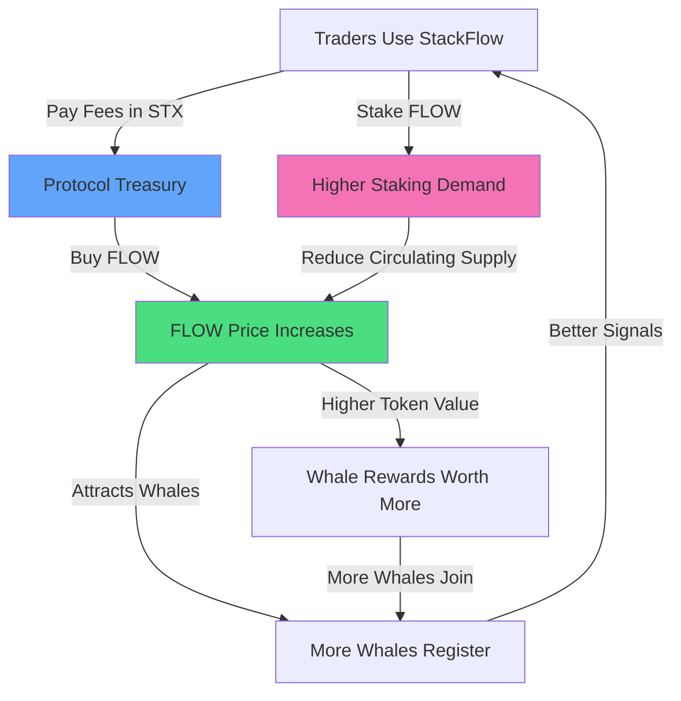

# FLOW Token Tokenomics

## Executive Summary

**FLOW** is the native utility and governance token of the StackFlow ecosystem. With a fixed supply of **100,000,000 FLOW**, the token creates a sustainable economic model that rewards participation, incentivizes transparency, and aligns stakeholders across the entire platform.

---

## Token Specifications

| Parameter | Value |
|-----------|-------|
| **Token Name** | stackflow |
| **Symbol** | FLOW |
| **Standard** | SIP-010 (Fungible Token) |
| **Total Supply** | 100,000,000 FLOW (fixed) |
| **Decimals** | 6 |
| **Blockchain** | Stacks (Bitcoin-secured) |
| **Contract Address** | SP3F4WEX90KZQ6D25TWP09J90D6CSYGW1JWXN5YF4.stackflow-flow-token |

---

## Distribution Breakdown

### Initial Allocation

| Category | Allocation | Amount (FLOW) | Vesting | Purpose |
|----------|-----------|---------------|---------|---------|
| **Community Rewards** | 40% | 40,000,000 | 4 years linear | Whale incentives, liquidity mining, copy trading rewards |
| **Ecosystem Development** | 25% | 25,000,000 | 5 years linear | Partnerships, marketing, grants, integrations |
| **Team & Contributors** | 20% | 20,000,000 | 4 years (1yr cliff) | Core team, advisors, early contributors |
| **Liquidity Provision** | 10% | 10,000,000 | Immediate | DEX liquidity (ALEX, Velar, future exchanges) |
| **Public Distribution** | 5% | 5,000,000 | Immediate | Fair launch, community airdrop, early adopters |

### Distribution Wallets

```clarity
Community Rewards Wallet: [TBD - Set via configure-distribution-wallets]
Ecosystem Wallet: [TBD - Set via configure-distribution-wallets]
Team Wallet: [TBD - Set via configure-distribution-wallets]
Liquidity Wallet: [TBD - Set via configure-distribution-wallets]
Public Distribution Wallet: [TBD - Set via configure-distribution-wallets]
```

---

## Vesting Schedules

### Community Rewards (40M FLOW - 4 Years)

**Purpose**: Incentivize long-term ecosystem growth

```
Year 1: 16M FLOW (40% of pool) - Bootstrap phase
Year 2: 12M FLOW (30% of pool) - Growth phase
Year 3: 8M FLOW (20% of pool) - Maturity phase
Year 4: 4M FLOW (10% of pool) - Sustainability phase
```

**Distribution Channels**:
- **Whale Signal Rewards**: 50% (20M FLOW)
  - Top whales earn based on copier count × performance
  - Monthly distribution: ~416K FLOW/month in Year 1
  
- **Liquidity Mining**: 30% (12M FLOW)
  - Copy trading pool stakers earn proportional rewards
  - Decreasing APY over time (100% → 20%)
  
- **Meme Pool Rewards**: 10% (4M FLOW)
  - Viral campaigns, community contests
  
- **Governance Participation**: 10% (4M FLOW)
  - Voters, proposal submitters

### Ecosystem Development (25M FLOW - 5 Years)

**Purpose**: Build partnerships and expand reach

```
Year 1: 7.5M FLOW (30%)
Year 2: 6.25M FLOW (25%)
Year 3: 5M FLOW (20%)
Year 4: 3.75M FLOW (15%)
Year 5: 2.5M FLOW (10%)
```

**Allocation Use Cases**:
- Integration partnerships (wallets, DEXs, aggregators)
- Marketing campaigns and KOL partnerships
- Developer grants for third-party tooling
- Cross-chain bridge development (sBTC, Lightning)

### Team & Contributors (20M FLOW - 4 Years, 1 Year Cliff)

**Purpose**: Align long-term incentives

```
Year 0-1: 0 FLOW (cliff period)
Year 1-4: 5M FLOW/year (linear unlock after cliff)
```

**Eligibility**:
- Core team members (founders, developers, designers)
- Strategic advisors
- Early contributors pre-mainnet launch

**Cliff Rationale**: Ensures team commitment before unlocking tokens

### Liquidity Provision (10M FLOW - Immediate)

**Purpose**: Ensure deep liquidity on DEXs

**Initial Pairs**:
- FLOW/STX on ALEX DEX: 5M FLOW
- FLOW/STX on Velar: 3M FLOW
- FLOW/sBTC (future): 2M FLOW reserved

**Liquidity Incentives**:
- LP providers earn additional FLOW from community rewards pool
- Prevents slippage and encourages trading volume

### Public Distribution (5M FLOW - Immediate)

**Purpose**: Fair launch and community ownership

**Breakdown**:
- **Airdrop to Early Users** (2M FLOW)
  - Users who traded on StackFlow testnet
  - Snapshot: [Launch Date - 30 days]
  
- **Fair Launch Event** (2M FLOW)
  - Public sale at fixed price ($0.10 FLOW)
  - Max allocation per wallet: 10,000 FLOW
  - Prevents whale accumulation
  
- **Community Contests** (1M FLOW)
  - Meme contests, referral campaigns
  - Social media engagement rewards

---

## Utility Mechanisms

### 1. Fee Discounts (Staking-Based)

Users who stake FLOW tokens receive tiered discounts on StackFlow options trading fees.

| Tier | Staked FLOW | Fee Discount | Annual Volume to Break Even* |
|------|-------------|--------------|------------------------------|
| **Ripple** | 1,000 | 10% | $10,000 |
| **Wave** | 5,000 | 25% | $25,000 |
| **Current** | 20,000 | 50% | $100,000 |
| **Ocean** | 100,000 | 75% | $500,000 |

*Assumes 0.1% protocol fee and FLOW price of $0.10

**Economic Impact**:
- Active traders save significantly (up to 75% on fees)
- Creates holding incentive (staking > selling)
- Reduces sell pressure on FLOW

### 2. Governance Rights

**Voting Power**: 1 FLOW = 1 Vote

**Governance Decisions**:
- New options strategies (e.g., Iron Condor, Jade Lizard)
- Protocol fee adjustments (currently 0.1% per trade)
- Treasury allocation for whale rewards
- Integrations with new sentiment sources (AI models, on-chain data)
- Contract upgrades and parameter changes

**Proposal Requirements**:
- Minimum 5,000 FLOW staked to submit proposal
- Quorum: 10,000 FLOW total votes required
- Approval: 60% "For" votes to pass

**Timelock**: 7-day execution delay after approval (safety mechanism)

### 3. Whale Signal Provider Rewards

**Eligibility**: Verified whales who register their wallet

**Reward Formula**:
```
Monthly FLOW Reward = (Copiers × Avg Trade Size × Performance Score) / 1000
```

**Example**:
- Whale has 100 copiers
- Avg trade size: $1,000
- Performance score: 8.5/10
- Monthly reward: (100 × 1000 × 8.5) / 1000 = **850 FLOW**

**Leaderboard**:
- Top 10 whales displayed on homepage
- Transparency builds trust and attracts more copiers

### 4. Liquidity Mining Rewards

**Mechanism**:
- Stake capital in copy trading pools → Earn FLOW
- APY decreases over time (emission schedule)

**Year 1 APY Projections**:
- High-risk pools (volatile whales): 80-120% APY
- Medium-risk pools (balanced): 40-60% APY
- Low-risk pools (conservative): 20-30% APY

**Lock-up Bonus**:
- No lock: Base APY
- 30-day lock: +10% APY
- 90-day lock: +25% APY
- 180-day lock: +50% APY

### 5. Premium Features Access

**Tier-Based Unlocks**:

| FLOW Held | Unlocked Features |
|-----------|-------------------|
| **500+** | Premium analytics dashboard |
| **2,000+** | AI-powered sentiment reports (Gemini 2.0) |
| **10,000+** | Early access to new strategies (7 days early) |
| **50,000+** | Private whale signals (Telegram DMs) |
| **100,000+** | 1-on-1 strategy consultations |

---

## Economic Model: The Flywheel



### Value Accrual Mechanisms

1. **Fee Revenue → Token Buybacks**
   - 50% of protocol fees used to buy FLOW from DEX
   - Bought FLOW is distributed as whale/LP rewards
   - Creates constant buying pressure

2. **Staking Reduces Supply**
   - Average staking rate target: 40-60% of circulating supply
   - Locked FLOW can't be sold → Reduces sell pressure
   - Higher staking = Higher price stability

3. **Demand from Utility**
   - Premium features require holding FLOW
   - Governance requires staking FLOW
   - Fee discounts require locking FLOW
   - Result: Natural demand beyond speculation

---

## Token Burn Mechanisms (Future Proposals)

**Potential Deflationary Mechanisms** (subject to governance vote):

1. **Performance Fee Burns**
   - 10% of profit-sharing fees from copy trading
   - Burned quarterly from treasury
   
2. **Governance Proposal Burns**
   - Failed proposals forfeit 10% of proposer's staked FLOW
   - Prevents spam proposals

3. **Inactivity Burns**
   - Unclaimed rewards after 1 year are burned
   - Encourages active participation

**Max Burn Target**: Up to 10% of total supply over 10 years (10M FLOW)

---

## Launch Strategy

### Phase 1: Mainnet Deployment (Day 0)

- Deploy FLOW token contract
- Deploy staking contract
- Deploy governance contract
- Configure distribution wallets
- Mint initial 100M FLOW

### Phase 2: Liquidity Bootstrap (Week 1)

- Provide FLOW/STX liquidity on ALEX and Velar
- Open public fair launch event (2M FLOW at $0.10)
- Distribute airdrop to testnet users (2M FLOW)

### Phase 3: Ecosystem Activation (Month 1)

- First 50 whales register and start earning rewards
- Launch liquidity mining for copy trading pools
- Release premium analytics dashboard for 500+ FLOW holders
- First governance proposal submitted

### Phase 4: Growth & Expansion (Months 2-6)

- Partner with major Stacks wallets (Leather, Xverse)
- List FLOW on CEXs (target: Gate.io, MEXC)
- Launch mobile app with FLOW staking
- Activate meme pool rewards

### Phase 5: Maturity (Year 1+)

- Cross-chain expansion (sBTC integration)
- Advanced AI sentiment (Gemini 2.0 Flash)
- Institutional partnerships
- Self-sustaining flywheel (fees > emissions)

---

## Risk Mitigation

### Token Distribution Risks

**Risk**: Team dumps tokens
**Mitigation**: 1-year cliff + 4-year linear vesting

**Risk**: Whale accumulation manipulates governance
**Mitigation**: Fair launch with max wallet caps (10K FLOW)

**Risk**: Low liquidity causes high slippage
**Mitigation**: 10M FLOW (10% of supply) allocated to DEX liquidity

### Market Risks

**Risk**: Bear market reduces trading volume → Less fee revenue
**Mitigation**: Diversified utility (governance, premium features) creates demand beyond trading

**Risk**: Competitor launches similar token
**Mitigation**: First-mover advantage + Bitcoin security via Stacks + Strong narrative

### Smart Contract Risks

**Risk**: Bugs or exploits in contracts
**Mitigation**: 
- Open-source code for community review
- Multi-signature admin controls
- Pause mechanism for emergencies
- Future audit by reputable firm (CoinFabrik, Least Authority)

---

## Long-Term Sustainability

### Year 1-2: Emission-Driven Growth

- **Reward Emissions**: High (60% of pool)
- **Fee Revenue**: Low-Medium
- **Treasury Action**: Minimal buybacks, focus on user acquisition

### Year 3-4: Transition Phase

- **Reward Emissions**: Moderate (30% of pool)
- **Fee Revenue**: Medium-High
- **Treasury Action**: Regular buybacks, balanced growth

### Year 5+: Fee-Driven Sustainability

- **Reward Emissions**: Low (10% of pool)
- **Fee Revenue**: High
- **Treasury Action**: Aggressive buybacks, deflationary pressure

**Goal**: By Year 5, protocol fees > emissions (self-sustaining model)

---

## Comparison to Other DeFi Tokens

| Token | Supply | Inflation | Utility | Governance | Bitcoin-Secured |
|-------|--------|-----------|---------|------------|-----------------|
| **FLOW** | 100M (fixed) | 0% native | ✅ High | ✅ Yes | ✅ Yes (Stacks) |
| UNI | 1B (10yr) | ~2%/year | ❌ Low | ✅ Yes | ❌ No (Ethereum) |
| SUSHI | Infinite | ~1%/year | ⚠️ Medium | ✅ Yes | ❌ No (Multi-chain) |
| CRV | 3B (gradual) | Decreasing | ✅ High | ✅ Yes | ❌ No (Ethereum) |

**FLOW Advantages**:
- Fixed supply (no inflation risk)
- Multi-faceted utility (not just governance)
- Bitcoin security (most secure blockchain)
- Aligned incentives (whales + traders + holders)

---

## Conclusion

FLOW token is designed to be the **economic backbone** of the StackFlow ecosystem. Through a carefully balanced distribution, strong utility mechanisms, and a self-reinforcing flywheel effect, FLOW creates sustainable value for all stakeholders:

- **Traders** save money on fees
- **Whales** earn rewards for transparency
- **Holders** get governance power and premium access
- **Liquidity providers** earn attractive yields
- **The protocol** becomes self-sustaining

The flow of capital always seeks the path of least resistance. With FLOW, **we've built that path**.

---

*Last Updated: December 27, 2025*  
*Contract Address: SP3F4WEX90KZQ6D25TWP09J90D6CSYGW1JWXN5YF4.stackflow-flow-token*
